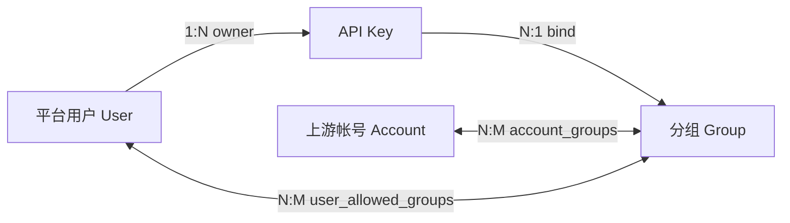
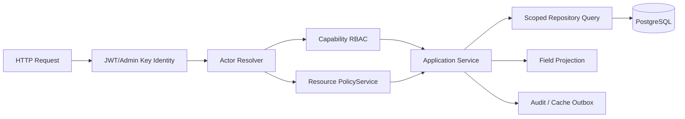

# 多租户资源权限与托管能力改造方案

> Date: 2026-08-20
> Status: Draft
> Branch: `codex/resource-permission-redesign`

## 1. 摘要

sub2api 当前的管理模型是“管理员管理全站上游资源，普通用户消费平台资源”：

- 平台用户只有 `admin`、`user` 两种角色。
- API Key 已归属于具体用户，普通用户只能管理自己的 Key。
- 上游帐号和分组是全局资源，没有 owner 或租户边界。
- 普通用户只能看到可绑定的分组，不能托管自己的上游帐号或创建分组。
- `user_allowed_groups` 只表达用户能否把 API Key 绑定到专属分组，不是通用资源授权。

如果仅新增一个 `hoster` 角色并开放现有管理员接口，托管者仍会看到和修改全站帐号、分组，无法满足资源隔离要求。

本方案采用两层授权模型：

1. **平台能力 RBAC**：回答“这个用户能否创建帐号、分组或执行平台级操作”。
2. **资源权限 ACL**：回答“这个用户能对哪个具体帐号或分组执行什么动作”。

管理员保留全局治理能力；用户新建的帐号和分组默认私有；资源所有者可以把资源按不同权限级别分享给指定用户、指定角色或全站已登录用户。

本方案保留全局稳定的 `account_id/group_id`、现有网关协议和分组内调度方式；但会收紧未分组帐号池、跨所有者帐号绑定和路由引用的安全边界。计费公式第一阶段不改，资源归属和用量归属需要增加快照字段。

## 2. 背景与现状

### 2.1 当前资源关系



其中：

- `api_keys.user_id` 是真实所有权，Key 的列表、读取、更新和删除均按用户校验。
- `accounts`、`groups` 没有 owner 字段，管理接口全部位于 `/api/v1/admin/**`。
- `account_groups` 只有帐号、分组和调度优先级，不记录关系建立者或授权来源。
- 非专属标准分组默认所有用户可绑定；专属分组依赖 `user_allowed_groups`；订阅分组依赖有效订阅。
- 管理员路由依靠 `admin` 角色整体放行，帐号和分组服务本身不接收操作者 Actor。

### 2.2 当前权限模型的局限

当前模型只能表达：

```text
管理员：管理全部资源
普通用户：管理自己的 API Key，并使用被允许的分组
```

无法表达：

- 用户只能查看自己的托管帐号和分组。
- 用户可以查看但不能使用某个分组。
- 用户可以使用分组但不能看到底层帐号。
- 用户可以维护某个帐号但不能分享、删除或转移它。
- 资源对某个用户、某个角色或全站用户开放。
- 授权的来源、授予人、有效期和撤销审计。
- 用户被停用后，其托管资源如何冻结、转移和恢复。

### 2.3 现有实现中的兼容约束

1. `is_exclusive` 目前参与 API Key 分组使用判断，不能直接改名或重新解释为资源私有性。
2. `user_allowed_groups` 已进入 API Key 鉴权缓存，并有跨实例缓存失效触发器，不能一次性替换。
3. 存量帐号和分组没有可靠信息可以推导原始 owner。
4. 调度、计费、用量日志和缓存广泛依赖全局稳定的帐号、分组 ID。
5. 分组名称目前对未删除记录全局唯一，多所有者场景需要重新确定唯一性范围。
6. 帐号存在创建、导入、复制、OAuth 建号、批量修改、刷新、测试等多个入口，不能只保护基础 CRUD。
7. 当前分组表单包含定价、利润、订阅、模型路由、回退分组等平台策略，不适合整体开放给托管用户。
8. `group_id = nil` 的 API Key 会进入全局未分组调度桶，未绑定分组的租户帐号不能沿用这一语义。
9. API Key 鉴权快照和 Scheduler 帐号快照是两套缓存/Outbox 链路，撤权时必须分别收敛。
10. 回退分组、模型路由和组合分组会在初始分组鉴权后引用其他资源，必须防止运行时绕过 ACL。

## 3. 目标与非目标

### 3.1 目标

- 保留现有管理员全部能力和存量行为。
- 允许获得平台资格的用户创建、查看、维护自己的上游帐号和分组。
- 用户新建资源默认私有，其他普通用户默认不可见、不可枚举、不可操作。
- 支持把帐号或分组分享给指定用户、指定角色或全站已登录用户。
- 区分查看、使用、维护、管理访问等动作，不把“看见”与“能够调用”混为一谈。
- API Key 继续归属于创建用户，并只能绑定用户有权使用且业务上符合资格的分组。
- 分组分享不隐式暴露底层帐号；帐号分享不泄露上游凭证。
- 租户帐号即使尚未配置完成，也不会进入平台全局未分组调度池。
- 帐号不能通过加入受众更大的分组被间接转授权。
- 撤权可以及时影响既有 API Key 和跨所有者的帐号分组关系。
- 所有权转移、授权、撤权和敏感维护操作可审计、可观测、可回滚。
- 迁移期间支持新旧权限模型并行，升级不能改变存量资源的可用性。

### 3.2 非目标

- 第一阶段不实现资源交易市场、收益分成或自动结算。
- 第一阶段不允许分享 API Key 记录或在多个用户间共同拥有一个 Key。
- 不把现有用户自定义属性当作角色或权限组。
- 不在本次改造中重写帐号调度器、网关协议或计费公式。
- 不允许普通资源权限授予者访问上游凭证原文。
- 不在未确认团队协作需求前引入完整组织、部门和层级继承体系。
- 不实现显式 Deny、复杂条件策略语言或 Zanzibar 类通用关系图。

## 4. 术语

| 术语 | 含义 |
| --- | --- |
| 平台用户 | 登录 sub2api 控制台的 User |
| 上游帐号 | `accounts` 中保存的 AI 平台帐号或 API 凭证，不是平台用户 |
| 分组 | `groups` 中的调度、模型和计费策略资源 |
| Actor | 当前操作的可信主体，包含用户 ID、角色、能力和认证方式 |
| Owner | 资源所有者，对资源拥有隐含的最高资源权限 |
| 平台资源 | 由平台管理、没有普通用户 owner 的存量或管理员资源 |
| 平台能力 | 跨资源类型的资格，如是否允许创建上游帐号 |
| 资源动作 | 针对具体资源的动作，如 `group.use`、`account.operate` |
| Grant | 某个资源对指定用户或角色授予的访问级别 |
| 全站开放 | 对所有已登录且状态正常的平台用户开放，不包含匿名互联网用户 |

## 5. 核心设计原则与不变量

### 5.1 默认拒绝、默认私有

- 新用户注册后不会自动获得托管上游帐号和创建分组的能力。
- 获得托管资格后，新建帐号、分组仍默认私有。
- 没有 owner、公开级别或有效 Grant 时，访问必须拒绝。
- 未授权读取统一返回 404，避免通过 ID 或响应差异枚举私有资源。

### 5.2 平台能力和资源权限分离

`account.create` 只表示可以创建上游帐号，不表示可以查看全站帐号。

`group.create` 只表示可以创建分组，不表示可以修改其他人的分组。

同理，角色不应因为拥有某类资源的创建能力而获得该类资源的全局列表权限。

### 5.3 查看与使用分离

- `group.view`：查看分组的安全元数据。
- `group.use`：把自己的 API Key 绑定到分组并通过它调用。
- `account.view`：查看帐号的安全元数据和可公开运行状态。
- `account.use`：允许该帐号参与 Actor 有权编辑的分组。

“可见”不能隐含“可调用”，“可使用”也不能隐含“可以编辑或分享”。

### 5.4 分享不级联暴露

- 分享分组不会自动授予底层帐号的 `account.view`。
- 分组消费者只知道分组可用性、平台、模型和与消费相关的安全信息。
- 帐号名称、邮箱、错误详情、代理、内部备注、凭证状态等字段按访问级别投影。
- 分享帐号不会自动分享包含它的其他分组。

### 5.5 凭证写入与凭证读取分离

- 上游 token、API Key、Cookie、私钥和 OAuth refresh token 是 write-only secret。
- Owner 和维护者可以替换或重新授权凭证，但日常 API 不返回原文。
- 管理员如确需导出原文，必须走独立 break-glass 流程、step-up 验证和完整审计。

### 5.6 权限在服务层强制

前端隐藏按钮和路由守卫只用于体验，不是安全边界。

所有读取、修改、批量操作、导入、复制、OAuth、测试和维护入口必须在服务层使用同一 PolicyService 判定。Repository 的列表接口必须在 SQL 层过滤可访问范围，不能先加载全表再在 Go 中过滤。

### 5.7 调度拓扑与租户边界

运行时仍以 `account_groups` 表达帐号是否参与某个显式分组，分组内候选选择不按请求用户再次切池。为保证这一点成立，写入控制面必须维护以下不变量：

- 用户自助创建的帐号必须绑定到该用户的私有分组，或绑定到系统为该用户创建的私有默认分组。
- 全局 `group_id = nil` / Scheduler group `0` 桶只允许 `owner_user_id IS NULL` 的平台帐号进入。
- 普通用户 API Key 不再通过“未绑定分组”消费租户帐号；自助流程必须要求选择一个具有 `group.use` 的显式分组。
- 建立 `account_groups` 关系时，除校验操作者权限外，还必须保证帐号 Owner 同意该分组的实际使用受众。

因此 Owner 一般不进入显式分组的调度热路径，但必须进入未分组查询的隔离条件和资源状态判断。不能只给 `accounts` 增加 `owner_user_id` 而保持未分组查询不变。

## 6. 总体架构



授权判定分为三类：

1. **创建动作**：检查 Actor 的平台能力。
2. **已有资源动作**：检查管理员旁路、Owner、全站访问级别和有效 Grant。
3. **业务资格**：在权限通过后继续检查订阅、余额、状态、配额等现有业务规则。

权限通过不等于业务资格通过。例如用户拥有 `group.use`，但订阅型分组的订阅已过期，仍然不能调用。

创建帐号或分组只检查 `account.create/group.create` 时，服务端必须强制 `public_access_level=NULL` 且不附带 Grant。若创建请求同时要求公开或分享，应在同一事务把它视为“私有创建 + 分享”，额外检查 `resource.share`、新资源 Owner 的 `manage_access`、配额和帐号-分组受众闭包；任一步失败则整个创建回滚。不能让创建参数绕过分享能力门禁。

## 7. 平台能力 RBAC

### 7.1 建议的能力代码

| 能力 | 含义 |
| --- | --- |
| `api_key.create` | 创建自己的 API Key |
| `account.create` | 创建自己的上游帐号 |
| `group.create` | 创建自己的分组 |
| `resource.share` | 分享自己拥有的资源 |
| `resource.transfer` | 转移自己拥有的资源 |
| `platform.resource.view_all` | 查看所有资源的安全投影 |
| `platform.resource.operate_all` | 对所有帐号执行平台运维动作 |
| `platform.resource.manage_all` | 管理全站资源，管理员旁路 |
| `platform.role.manage` | 管理角色和角色能力 |
| `platform.grant.manage` | 代表平台授予或撤销资源权限 |
| `platform.secret.export` | 执行受控凭证导出，不由普通角色继承 |

能力代码是后端常量和数据库种子数据的共同契约，不能由前端自由拼接。

平台能力和资源动作对高影响操作采用双重门禁：

- 分享资源：同时需要 `resource.share` 和该资源的 `manage_access`。
- 用户主动转移自己的资源：同时需要 `resource.transfer`、当前 Owner 身份和 step-up 验证。
- 平台资源分配或管理员接管：使用独立管理员命令，要求 `platform.resource.manage_all` 和 step-up 验证，不伪造 Owner 身份。
- 全站查看：`platform.resource.view_all` 只覆盖 `view`，不能执行维护动作。
- 全站运维：`platform.resource.operate_all` 只覆盖 `view/operate`，不能编辑、分享、删除或转移。
- `platform.resource.manage_all` 才是完整管理员旁路。

### 7.2 建议的内置角色

| 角色 | 默认能力 | 说明 |
| --- | --- | --- |
| `user` | `api_key.create` | 普通消费用户 |
| `hoster` | `api_key.create`、`account.create`、`group.create`、`resource.share` | 可以托管自己的资源 |
| `platform_operator` | 受控的全局查看和运维能力 | 不等于管理员，不拥有凭证导出能力 |
| `admin` | 全局治理旁路 | 保持现有兼容语义 |

实施初期保留 `users.role = admin/user` 作为兼容字段，同时新增多角色表。现有 `admin` 用户映射到系统管理员角色；现有普通用户映射到基础用户角色。待后端和前端不再依赖单一角色字符串后，再评估是否删除旧字段。

### 7.3 RBAC 数据表

```text
roles
  id, code, name, description, is_system, authz_version, created_at, updated_at

permissions
  id, code, description, created_at

role_permissions
  role_id, permission_id, created_at

user_roles
  user_id, role_id
  granted_by_user_id NULL
  granted_by_service_principal_id NULL
  expires_at, created_at

service_principals
  id, code, name, status, authz_version, created_at, updated_at

service_principal_roles
  service_principal_id, role_id, granted_by_user_id, expires_at, created_at
```

约束：

- `roles.code`、`permissions.code` 唯一。
- 现有 `users` 增加 `authz_version`；角色成员、角色能力、用户状态和 Service Principal 角色变化时，在同一事务递增对应主体或角色版本。
- 系统角色不可删除，只能修改允许开放的能力集合。
- `user_roles` 支持有效期；过期角色不参与判定。
- `user_roles` 的两种 `granted_by_*` 必须且只能设置一个，机器身份授予不能伪装成自然人。
- `service_principal_roles` 只允许平台管理员配置，V1 不允许机器身份自行修改自己的角色。
- 管理员角色变更必须使会话权限缓存失效。
- 全局管理员 API Key 等机器身份映射到独立 Service Principal，不占用自然人用户角色。
- 不把角色列表完整写死在 JWT。当前请求仍以数据库最新状态或短 TTL 权限快照为准。

### 7.4 旧角色字段迁移

`users.role` 目前仍被管理员中间件和前端直接读取，迁移期间不能与 `user_roles` 形成两个独立权威源。建议增加全局 `role_authorization_mode=legacy/shadow/rbac`：

1. `legacy`：`users.role` 继续决定现有 admin/user 行为；回填系统 admin/user 角色，新表只做影子比较。
2. `shadow`：所有 admin 提升、降级通过统一 RoleService，在同一数据库事务双写 `users.role`、`user_roles`、`authz_version` 和失效 Outbox；安全判定仍以旧字段为准并记录差异。hoster 等新增非管理员角色只存在新表，只影响已经接入 PolicyService 的新能力。
3. `rbac`：所有管理员中间件、JWT 刷新、前端用户投影和后台任务已改为 Actor/RBAC 后，事务性切换为仅以 `user_roles/role_permissions` 判定；`users.role` 变为只读兼容投影，不能再参与允许判定。
4. 只有在不存在无法映射的管理员角色和 Service Principal 配置时才能切回 `legacy`。旧版本实例必须全部退出后，才能开放 RBAC 独有的管理员授权方式。

任何入口都不能使用 `users.role == admin OR RBAC admin` 长期放行。管理员撤权事务提交后，两套字段在 shadow 阶段必须同时失效；在 rbac 阶段即使旧字段残留为 admin 也不能进入管理员接口。

## 8. 资源权限 ACL

### 8.1 原子资源动作

#### 分组动作

| 动作 | 含义 |
| --- | --- |
| `group.view` | 查看允许公开的分组字段 |
| `group.use` | 绑定自己的 API Key 并调用 |
| `group.edit` | 修改允许下放的分组配置和帐号成员 |
| `group.manage_access` | 公开、分享、撤权 |
| `group.delete` | 软删除分组 |
| `group.transfer` | 转移所有权 |

#### 上游帐号动作

| 动作 | 含义 |
| --- | --- |
| `account.view` | 查看安全元数据、状态和允许的统计 |
| `account.use` | 将帐号加入 Actor 有权编辑的分组 |
| `account.operate` | 测试、刷新、启停和清除可恢复状态 |
| `account.edit` | 修改允许下放的配置、替换凭证 |
| `account.manage_access` | 公开、分享、撤权 |
| `account.delete` | 软删除帐号 |
| `account.transfer` | 转移所有权 |

### 8.2 面向 UI 的授权预设

数据库保存 `access_level`，后端把访问级别映射为固定动作集合。第一版不提供逐动作自定义，以控制组合数量和测试面。

| 访问级别 | 分组动作 | 帐号动作 |
| --- | --- | --- |
| `viewer` | `view` | `view` |
| `consumer` | `view`, `use` | `view`, `use` |
| `maintainer` | `view`, `use`, `edit` | `view`, `use`, `operate`, `edit` |
| `manager` | `view`, `use`, `edit`, `manage_access` | `view`, `use`, `operate`, `edit`, `manage_access` |
| Owner | 全部动作 | 全部动作 |

约束：

- `manager` 默认不能删除或转移资源；这两个动作保留给 Owner 和平台管理员。
- 接受者默认不能二次分享，只有 `manager`、Owner 或平台管理员可以管理访问。
- 多个 Grant 同时命中时取最高有效级别。
- 第一版没有显式 Deny，因此不会出现 allow/deny 优先级歧义。
- Grant 过期与主动撤销具有相同效果。

### 8.3 全站访问级别

帐号和分组增加 `public_access_level`，取值为 `NULL/viewer/consumer`：

- `NULL`：私有，仅 Owner、显式 Grant 和管理员可访问。
- `viewer`：所有正常登录用户可查看安全投影。
- `consumer`：所有正常登录用户可查看和使用。

第一版不允许把 `maintainer` 或 `manager` 设为全站访问级别。

产品文案使用“全站用户可见/可用”，不使用容易被理解为匿名互联网的“公开”。

### 8.4 授权判定顺序

```text
Authorize(actor, action, resource):
  1. actor 不存在、被停用或会话失效 -> DENY
  2. resource 不存在或已删除 -> NOT_FOUND
  3. actor 拥有覆盖该 action 的平台级能力 -> ALLOW
  4. resource.owner_user_id == actor.user_id -> ALLOW
  5. public_access_level 覆盖 action -> ALLOW
  6. actor 的用户 Grant 覆盖 action -> ALLOW
  7. actor 任一有效角色的 Grant 覆盖 action -> ALLOW
  8. 其他情况 -> DENY
```

读取被拒绝时对外返回 404。资源已经可见但动作不足时返回 403。内部审计记录真实拒绝原因，但不能把资源存在性泄露给调用方。

`Authorize` 只计算具体资源动作。分享、转移等高影响命令还要在 Application Service 中叠加上一节的平台能力门禁，不能把 Owner 身份等同于无限平台资格。

### 8.5 资源 Grant 表

为保证资源外键完整性，帐号和分组使用独立授权表，不使用缺少资源外键的通用 `resource_type/resource_id` 表。

```text
account_access_grants
  id
  account_id -> accounts.id ON DELETE CASCADE
  grantee_user_id -> users.id NULL
  grantee_role_id -> roles.id NULL
  access_level
  granted_by_user_id -> users.id NULL
  granted_by_service_principal_id -> service_principals.id NULL
  expires_at NULL
  created_at, updated_at

group_access_grants
  id
  group_id -> groups.id ON DELETE CASCADE
  grantee_user_id -> users.id NULL
  grantee_role_id -> roles.id NULL
  access_level
  granted_by_user_id -> users.id NULL
  granted_by_service_principal_id -> service_principals.id NULL
  expires_at NULL
  created_at, updated_at
```

数据库约束：

- `grantee_user_id`、`grantee_role_id` 必须且只能设置一个。
- 两种 `granted_by_*` 必须且只能设置一个，禁止把机器身份伪装成自然人。
- 分别建立 `(resource_id, grantee_user_id)` 和 `(resource_id, grantee_role_id)` 部分唯一索引。
- `access_level` 使用受约束字符串或枚举，服务层与数据库值保持单一映射。
- Grant 更新和撤销必须与不可变的权限变更事件、缓存失效 outbox 位于同一事务；现有请求级审计中间件可补充记录，但不能替代事务内事件。

## 9. 资源所有权与数据模型

### 9.1 帐号和分组新增字段

```text
accounts
  owner_user_id BIGINT NULL
  created_by_user_id BIGINT NULL
  public_access_level VARCHAR NULL
  access_version BIGINT NOT NULL DEFAULT 1

groups
  owner_user_id BIGINT NULL
  created_by_user_id BIGINT NULL
  public_access_level VARCHAR NULL
  access_version BIGINT NOT NULL DEFAULT 1
  authorization_mode VARCHAR NOT NULL DEFAULT 'legacy'
```

语义：

- `owner_user_id IS NULL` 表示平台资源，不表示任意用户可访问。
- 平台资源仍由管理员治理，其消费者权限由公开级别、Grant、订阅等规则决定。
- 用户自助创建时，`owner_user_id`、`created_by_user_id` 都是当前 Actor。
- 管理员代表用户创建时必须显式指定 owner，不能隐式归给管理员本人。
- `access_version` 在公开级别、Owner、Grant 或影响授权的状态变化时递增。
- Owner 和 creator 外键不得因硬删除用户而级联删除资源；用户硬删除前必须先完成显式转移或转成平台资源。
- `authorization_mode` 只用于分组使用权迁移，取 `legacy/shadow/acl`；同一分组在任一时刻只有一个权威授权源。

### 9.2 API Key

API Key 已有 `user_id`，继续作为 Owner，不新增资源 Grant。

第一版规则：

- Key 只能由 Owner 和平台管理员查看、更新和删除。
- Key 只能绑定 Owner 当前拥有 `group.use` 且业务资格有效的分组。
- Key 的分组使用权必须在网关运行时再次确认，不能只在创建时检查。
- 撤销分组使用权后，既有 Key 必须立即或在约定的极短缓存窗口内停止调用。

长期安全加固可以把 Key 改为“创建时展示一次，数据库只保存 Hash 和后四位”，但不作为本次资源权限上线的阻塞项。

### 9.3 帐号与分组关系

建立 `account_groups` 关系时，Actor 必须同时具备：

```text
account.use(account_id)
AND
group.edit(group_id)
```

这两个权限只证明 Actor 可以发起绑定，还不足以允许他扩大帐号的实际使用范围。系统还必须满足以下任一条件：

1. 分组所有 `group.use` 受众都是帐号 `account.use` 的同等受众或子集；或
2. 帐号 Owner 对“帐号加入该具体分组及其当前分享范围”给出显式批准。

这里的受众包含全站级别、用户 Grant、角色 Grant 和 Owner。分组新增 consumer、角色成员变化或从私有改为全站可用时，必须在事务内重新校验全部借入帐号；不满足时拒绝扩大分享范围，不能静默把帐号暴露给新受众。

建议为 `account_groups` 增加：

```text
linked_by_user_id NULL
linked_by_service_principal_id NULL
authorization_kind   // owner, explicit_grant, role_grant, public, platform
authorization_account_grant_id NULL -> account_access_grants.id
owner_approval_id NULL -> account_group_share_approvals.id
authorization_state  // pending, active, invalid
validated_account_access_version
validated_group_access_version

account_group_share_approvals
  id
  account_id -> accounts.id
  group_id -> groups.id
  approved_by_user_id -> users.id
  group_access_version
  expires_at NULL
  revoked_at NULL
  created_at
```

两种 `linked_by_*` 必须且只能设置一个。`authorization_kind` 决定两个授权外键中应设置哪一个；Owner、public、platform 等隐含来源不伪造 Grant ID。Owner 批准只覆盖批准时的 `group_access_version`，分组受众变化后必须重新校验或重新批准，不能沿用旧批准扩大受众。

单个授权来源只用于归因，不能代表完整受众闭包。关系只有在系统对帐号完整 `account.use` 受众和分组完整 `group.use` 受众做集合校验后，才写入两个已验证版本并标记 `active`。帐号或分组的 Owner、公开级别、Grant、状态发生变化时递增各自 `access_version`；角色成员变化则定位引用该角色的 Account/Group Grant，递增受影响资源版本并批量重算关联关系。

Scheduler 只加载 `authorization_state=active` 且两个已验证版本仍等于资源当前版本的关系。版本不匹配立即视为不可调度并写入重算队列，重算通过后再更新版本和恢复；不能先继续使用旧关系再异步判断。

这些字段用于审计、受众闭包校验和撤权重算；Scheduler 快照构建会校验状态和版本，但分组内的候选选择热路径不扫描 Grant 表。

当帐号访问被撤销时：

1. 找到由该授权建立的跨所有者关系。
2. 先把关系标记为 `pending`，再重新计算分组全部 `group.use` 受众是否仍被帐号全部 `account.use` 受众覆盖，或是否存在匹配当前分组版本的 Owner 批准。
3. 闭包不成立时，事务内标记 `invalid` 或删除关系；闭包仍成立时记录新的完整版本和实际授权来源后恢复 `active`。
4. 写入 Scheduler Outbox，使各实例刷新该分组的调度快照。

帐号 Owner 始终可以主动把自己的帐号从任意分组撤出，防止共享关系锁定资源。

类型化授权外键必须记录真正允许该关系成立的 Account Grant 或 Owner 批准记录。仅记录链接人或使用无外键的多态 ID，无法在授权过期、角色变化、批准失效或撤权时精确清理关系。

### 9.4 分组名称唯一性

当前分组名称全局唯一。多所有者场景建议改为所有者范围唯一：

```text
平台资源：lower(name) 在 owner_user_id IS NULL 范围唯一
用户资源：(owner_user_id, lower(name)) 在未删除范围唯一
```

共享列表允许出现同名分组，前端必须同时展示 Owner 或来源。所有 API 关系继续使用 ID，不使用名称作为授权标识。

现有 `<platform>-default` 自动建组和 `openai-default` 回落逻辑必须增加 `owner_user_id IS NULL` 条件。否则名称唯一性放宽后，平台启动或帐号自动绑定可能命中租户同名分组。

### 9.5 未分组帐号与租户默认分组

当前 Scheduler 会把 `nil` 分组归一化为 group `0`，并查询全局未分组帐号。V1 不扩展该缓存键为 `owner + group + platform`，而采用更小的改造：

- group `0` 保留为平台兼容桶，只包含 `owner_user_id IS NULL` 的帐号。
- 每个获得托管资格的用户按需创建一个普通私有默认分组，使用真实全局 group ID。
- 自助创建帐号时，未显式选择分组则绑定到该私有默认分组；创建帐号和绑定关系同事务提交。
- 如果绑定失败，帐号保持不可调度，不能先作为未分组帐号可用。
- 删除最后一个绑定关系时，租户帐号自动变为不可调度，或先绑定回 Owner 私有默认分组。

简单运行模式当前会把分组归一化为 group `0` 并按平台读取全部帐号，因此在开启自助托管前也必须增加平台帐号过滤，或明确禁止简单模式启用该功能。

## 10. 共享语义

### 10.1 分享分组

推荐默认语义：

- “分享为可见”：授予 `viewer`。
- “分享为可使用”：授予 `consumer`，接受者可以绑定自己的 API Key。
- 接受者看不到底层帐号列表、帐号 ID、帐号名称、邮箱、代理、错误详情和凭证状态。
- 分组 Owner 只能看到平台允许的脱敏聚合用量，不包含消费者身份、API Key 标识或提示词等请求正文。

订阅型分组仍必须通过现有订阅资格校验。资源 ACL 不得绕过有效订阅、余额、状态和配额规则。

### 10.2 分享帐号

推荐默认语义：

- `viewer`：只看脱敏健康状态和 Owner 允许公开的统计。
- `consumer`：可以把帐号加入自己有权编辑的分组。
- `maintainer`：可以测试、刷新、启停、修改允许下放的配置和重新授权。
- `manager`：可以在 Owner 授权范围内管理帐号分享。

以下信息永不因普通分享返回：

- API Key、access token、refresh token、Cookie、私钥。
- 管理员内部备注和完整上游错误体。
- 代理凭证、内部网络地址和未脱敏的帐号身份信息。
- 其他分组和其他消费者的敏感关联。

### 10.3 分享给角色

角色 Grant 是动态授权：用户获得或失去该角色时，会自动获得或失去对应资源权限。

因此：

- UI 必须提示“未来加入此角色的用户也会获得访问”。
- 角色成员变化必须触发相关资源和 API Key 鉴权缓存失效。
- 第一版不支持嵌套角色或角色继承。
- 用户自定义属性不能作为角色 Grant 主体。
- 非 Owner 的 manager 不能授予高于自己有效级别的权限，也不能转移 Owner。
- 创建或修改 Grant 时必须重新计算操作者的当前有效权限，不能相信请求中的 `my_access_level`。

## 11. 控制面 API 设计

### 11.1 普通用户资源 API

建议在现有 JWT 用户路由下增加资源级接口：

```text
GET    /api/v1/accounts
POST   /api/v1/accounts
GET    /api/v1/accounts/:id
PATCH  /api/v1/accounts/:id
DELETE /api/v1/accounts/:id
POST   /api/v1/accounts/:id/test
POST   /api/v1/accounts/:id/refresh

GET    /api/v1/accounts/:id/grants
POST   /api/v1/accounts/:id/grants
PATCH  /api/v1/accounts/:id/grants/:grant_id
DELETE /api/v1/accounts/:id/grants/:grant_id
PUT    /api/v1/accounts/:id/public-access
POST   /api/v1/accounts/:id/transfer

GET    /api/v1/groups
POST   /api/v1/groups
GET    /api/v1/groups/:id
PATCH  /api/v1/groups/:id
DELETE /api/v1/groups/:id

GET    /api/v1/groups/:id/grants
POST   /api/v1/groups/:id/grants
PATCH  /api/v1/groups/:id/grants/:grant_id
DELETE /api/v1/groups/:id/grants/:grant_id
PUT    /api/v1/groups/:id/public-access
POST   /api/v1/groups/:id/transfer
```

列表接口默认返回 Actor 可见的并集，并支持：

```text
scope=owned|shared|platform|all
access_level=viewer|consumer|maintainer|manager
owner_id=
platform=
status=
search=
```

响应应包含：

```json
{
  "owner": {"id": 123, "display_name": "..."},
  "ownership": "owned|shared|platform",
  "my_access_level": "manager",
  "public_access_level": null,
  "can": {
    "view": true,
    "use": true,
    "operate": true,
    "edit": true,
    "manage_access": true,
    "delete": false,
    "transfer": false
  }
}
```

`can` 只帮助前端渲染，后端仍需在每次操作时重新授权。

分享对象搜索必须防止用户枚举：优先要求精确邮箱、用户 ID 或明确邀请标识，返回最小展示信息，并施加单用户速率限制。普通用户不能通过模糊搜索下载全站用户目录。

### 11.2 管理员 API

保留现有 `/api/v1/admin/accounts`、`/api/v1/admin/groups`，增加 Owner、来源、公开级别和访问状态筛选。

管理员管理页面仍是全站运维视图，不和用户“我的资源”页面复用同一个数据范围。底层 DTO、校验和业务服务可以复用，但管理员旁路必须显式传入 Actor，不能继续依赖“路由已经是 admin”这一隐含假设。

角色、权限和用户角色绑定使用独立管理员 API；系统 `admin` 角色不能由普通资源 manager 授予。角色删除默认 restrict：仍被用户或资源 Grant 引用时拒绝删除，必须先显式迁移或撤销关系。

平台资源分配给用户、管理员接管用户资源以及把用户资源转为平台资源使用独立管理员命令，不复用“当前 Owner 主动 transfer”的接口。命令需要 `platform.resource.manage_all`、step-up、目标用户托管资格校验、完整闭包重算和 durable audit。

### 11.3 幂等与批量操作

- 创建资源和创建 Grant 继续使用项目现有幂等机制。
- 批量操作必须先解析全部资源并完成逐项授权，再在事务中写入。
- 默认采用 all-or-nothing，避免只修改一部分资源造成难以理解的权限状态。
- 批量响应不得泄露 Actor 无权查看的资源是否存在。

### 11.4 OAuth 与导入入口

- OAuth state 必须绑定发起用户、目标资源或一次性建号会话，回调不能由请求参数替换 Owner。
- 导入、同步、复制和批量创建必须逐条写入当前 Actor 的 owner，或要求管理员显式指定 owner。
- 非 Owner 的重新授权需要 `account.edit`，且不能借此读取旧凭证。
- 导出凭证不属于普通资源 API，继续要求管理员专用能力和 step-up 验证。

## 12. 服务与 Repository 改造

### 12.1 Actor

建议统一可信主体：

```go
type Actor struct {
    UserID             int64
    ServicePrincipalID int64
    RoleIDs            []int64
    Capabilities       map[string]struct{}
    SubjectAuthzVersion int64
    RoleVersions       map[int64]int64
    IsAdmin            bool
    AuthMethod         string
}
```

Actor 由认证中间件之后的 Resolver 构造。服务方法接收 Actor，而不是只接收裸 `userID`：

```go
CreateAccount(ctx, actor, input)
UpdateAccount(ctx, actor, accountID, input)
ListAccounts(ctx, actor, filters, pagination)
```

后台 Worker、调度器等可信内部流程不伪造管理员用户，应使用明确的 SystemActor 或独立内部接口。

用户 Actor 与 Service Principal Actor 必须互斥。SystemActor 只能由进程内受信任组件构造，任何 HTTP 请求都不能通过 Header 或请求体声明自己是 SystemActor。

`SubjectAuthzVersion/RoleVersions` 用于发现请求处理中发生的用户停用、角色移除和角色能力修改，不表示可以永久信任 Actor 中缓存的能力集合。

### 12.2 PolicyService

```go
type ResourcePolicy interface {
    CheckCapability(ctx context.Context, actor Actor, capability Capability) (Decision, error)
    CanCreate(ctx context.Context, actor Actor, resourceType ResourceType) (Decision, error)
    Authorize(ctx context.Context, actor Actor, action Action, ref ResourceRef) (Decision, error)
    AccessibleScope(ctx context.Context, actor Actor, resourceType ResourceType, minimum Action) (AccessibleScope, error)
}
```

要求：

- 同一动作只存在一份权威映射。
- PolicyService 不负责余额、订阅等业务资格。
- 判定结果包含匹配来源，供审计和关系授权来源记录使用。
- 拒绝原因使用稳定内部代码，外部响应按资源可见性映射为 404 或 403。
- 同一最高访问级别存在多个来源时，归因优先级固定为 public、直接用户 Grant、角色 Grant；同类 Grant 选择最小 Grant ID，角色 Grant 再以最小 Role ID 决定。
- `AccessibleScope` 只能由 PolicyService 构造，零值或字段不完整时 Repository 必须 fail closed；Scope 保存精确资源类型和动作，调用方不能把 view Scope 复用于 edit/use。
- System Actor 默认不具有通用资源或平台能力旁路。需要持久化授权写入的后台任务必须使用 Service Principal；只读 Worker 的 System Actor allowlist 在接入时逐项评审。

### 12.3 SQL 范围过滤

帐号、分组列表的可见条件应在 SQL/Ent Predicate 中表达：

```text
owner_user_id = actor.user_id
OR public_access_level covers requested action
OR EXISTS active user grant
OR EXISTS active role grant
OR actor has platform-wide capability
```

必须为 owner、公开级别、Grant 用户、Grant 角色和有效期建立索引，并用生产规模数据检查查询计划。禁止普通用户列表走 `ListAll()` 后在 Go 中过滤。

### 12.4 并发与 TOCTOU

“先授权、后写入”之间可能发生 Owner 转移、Grant 撤销或资源版本变化。敏感修改必须在事务中锁定资源行并根据最新 Actor、Grant 和 `access_version` 重新判定，或使用带版本条件的原子更新。

- Grant、Owner、公开级别和删除操作必须使用行锁或乐观版本条件。
- 批量操作的最终授权检查在写事务内完成，事务外预检查只用于快速失败。
- 分享、转移、删除、凭证替换和角色管理在写事务内还必须读取当前主体/角色授权版本；版本变化时从数据库重新解析 Actor 并重新授权，不能继续使用请求入口缓存的 `RoleIDs/Capabilities`。
- RoleService 修改成员或能力时递增 `users.authz_version/roles.authz_version` 并写失效 Outbox；敏感写入通过版本条件或按固定顺序锁定主体、角色和资源，防止与撤权事务交错放行。
- 冲突返回稳定的 409，不把资源存在性泄露给无查看权用户。
- 所有权转移和 Grant 变更需要防止重复提交、并发升级和 lost update。

### 12.5 引用资源的 IDOR 校验

帐号和分组表单包含大量关联 ID，写入时必须验证关联资源权限：

- `group_id`、帐号成员 ID。
- `proxy_id`、TLS 指纹模板 ID。
- `fallback_group_id`。
- 模型路由中的帐号 ID。
- 父子帐号 ID、影子帐号。
- 复制源、导入目标和批量操作 ID。

普通托管用户第一阶段不开放全局代理、利润控制、平台订阅、回退分组和高级模型路由；后续开放时必须分别定义资源权限或平台模板，而不能只验证 ID 存在。

### 12.6 派生数据面

资源范围必须传播到所有派生查询，而不只是帐号、分组 CRUD：

- 用量日志、错误详情、统计、排行榜和 Dashboard。
- 帐号额度、测试、刷新、健康状态和 Channel Monitor。
- 模型广场、自动补全、搜索、导出和批量选择器。
- WebSocket/Ops 实时数据、通知和审计详情。

普通分组消费者的用量响应不得包含可反推出底层帐号的 `account_id/account_name`。聚合总数、分页 total 和错误差异也必须按 Actor 的可见范围计算，避免侧信道泄露。

回退分组、模型路由和组合分组需要额外按“引用闭包”处理。当前网关先校验 API Key 的原分组，之后仍可能切换 `fallback_group_id`、使用模型路由中的帐号 ID 或命中组合分组路由。开放这些配置前必须同时做到：

- 保存时校验所有直接和间接目标，禁止形成循环或跨越未授权资源。
- 分组分享范围扩大、目标 Grant 撤销和角色变化时重新验证引用闭包。
- 运行时对最终分组和候选帐号再次检查有效关系，不能把创建时校验当成永久授权。
- 调度快照只包含通过闭包校验的帐号；失效事件与配置变更同事务写入 Scheduler Outbox。

因此 V1 将 fallback、model routing、composite routes、订阅配置、显式模型价格、利润控制和帐号成本倍率保持为平台管理员专属能力。

## 13. API Key 运行时鉴权与缓存

### 13.1 有效分组使用权

API Key 对分组的最终使用资格为：

```text
资源权限允许 group.use
AND 用户状态有效
AND API Key 状态、过期、IP、额度有效
AND 分组状态有效
AND 订阅/余额等业务资格有效
```

权限 ACL 和订阅资格必须保持两个明确阶段，防止资源分享绕过付费规则，也防止订阅逻辑意外授予管理权限。

### 13.2 两条缓存失效链

资源撤权同时影响“这个 Key 能否使用分组”和“这个分组会调度哪些帐号”，两者不能共用一个模糊的缓存清理动作：

| 变更 | API Key Auth Cache / Outbox | Scheduler Snapshot / Outbox |
| --- | --- | --- |
| Group Grant、公开级别、Owner、状态 | 必须失效 | 受众或引用闭包变化时必须重算并失效 |
| 用户角色、角色权限 | 必须失效 | 定位引用该角色的资源，递增版本并重算相关跨 Owner 关系 |
| 用户停用、删除、恢复 | 必须失效 | 必须隔离/恢复其 Owner 帐号并失效所在分组快照 |
| Account Grant 撤销导致解绑 | 可能影响管理会话 | 必须失效帐号及新旧分组桶 |
| `account_groups`、帐号状态、可调度状态 | 不一定失效 | 必须失效 |

实施要求：

- 用户 Grant 变化：失效该用户在该分组下的 Key。
- 角色 Grant 变化：失效当前角色成员在该分组下的 Key；用户角色变化则失效该用户所有受影响的 Key。
- 角色成员或能力变化：除 Auth Cache 外，还要查找以该角色为主体的 Account/Group Grant，递增资源版本；相关 `account_groups` 先变为 `pending`，闭包重算通过后才能重新进入 Scheduler。
- 用户停用或删除：在状态事务内递增用户授权版本，把其 Owner 帐号标记为不可调度，写入这些帐号所在全部分组的 Scheduler Outbox；不能只阻止登录。
- 全站访问级别变化：递增 `group.access_version`，并按分组失效所有 Key。
- Grant、Owner、角色或公开级别变更与 auth cache invalidation outbox 必须同事务。
- 帐号解绑、状态变化和 `account_groups` 重算与 Scheduler Outbox 必须同事务。
- 当前部分 `AddToGroup`、`RemoveFromGroup`、`BindGroups` 在提交后 best-effort 写 Scheduler Outbox；安全关键路径必须改为同事务持久化，不能只记日志后返回成功。
- `APIKeyAuthSnapshot` 增加 ACL 来源、`access_version` 和最近授权到期时间；当前快照版本为 `20`，字段上线时必须 bump version 强制旧快照失效。

不能仅依赖固定 TTL，因为撤销访问是安全操作。大范围角色或全站 Grant 变化不应同步逐个删除海量 Key，可通过用户/角色/分组授权版本和 Redis namespace version 使旧快照整体失效，再由 Outbox 异步清理。需要给出跨实例最大收敛时间 SLA，并监控两条 Outbox 的积压和失败。

Grant 带 `expires_at` 时，快照必须保存绝对到期时间并在每个请求按当前时间判断；缓存 TTL 不得越过最近到期时间，不能把“当时有效”的布尔结果长期缓存。

### 13.3 权威授权源与可用分组

`/groups/available`、模型广场、API Key 创建/更新和网关运行时必须使用同一套 `group.use` 判定。迁移期可以双写和影子比较，但不能长期使用下面这种权威判定：

```text
legacy user_allowed_groups OR new group ACL
```

否则从新 ACL 撤权后，旧表仍会把用户重新放行。每个分组使用 `authorization_mode` 明确权威源：

| 模式 | 权威判定 | 用途 |
| --- | --- | --- |
| `legacy` | `is_exclusive/user_allowed_groups` | 存量行为不变 |
| `shadow` | 仍以 legacy 返回结果，同时计算 ACL 差异 | 回填校验 |
| `acl` | 只以 Owner/public/Grant 判定 | 完成切换后的资源 |

新建租户分组从第一天使用 `acl`，同时保持 `is_exclusive=true`，让不认识 ACL 的旧实例 fail closed。只有所有网关实例都已支持 `authorization_mode` 后，才能开启自助托管；角色 Grant、过期 Grant 等无法等价写回旧表的能力必须等全量升级和 ACL cutover 后再开放。

分组从 `shadow` 切到 `acl` 需要事务性更新模式、递增 `access_version` 并写 auth invalidation outbox。切换后旧表只能作为回滚数据，不能再参与允许判定。

### 13.4 长连接与异步任务撤权

HTTP API Key 中间件只覆盖请求建立时刻。WebSocket、粘性会话和异步图片/视频任务需要定义额外检查点：

- WebSocket 握手后，每个新的 client turn 检查 API Key 状态、用户状态、最终分组 `access_version` 和 Grant 到期时间；撤权后关闭连接或拒绝下一轮。
- 撤权前已经发往上游的一轮允许完成并正常计费，但不得在撤权后开始新的 retry、fallback 或上游尝试。
- 粘性会话只复用帐号选择提示，命中帐号前仍检查它与最终分组的有效关系，不能因旧 session 记录绕过解绑。
- queued 异步任务在真正选帐号和发起上游请求前重新鉴权；已撤权任务标记为 `permission_revoked`，不继续执行。
- in-flight 异步任务允许当前上游操作完成，但撤权后不得创建新的阶段、重试或扩展任务。具体边界写入任务状态机和审计。
- 帐号测试、刷新、OAuth 续期等后台动作在入队和执行时都检查帐号状态；用户停用或帐号转移后，旧任务不得继续替换凭证。

### 13.5 授权到期、撤权 SLA 与降级策略

`expires_at` 不是只供查询过滤的展示字段。系统需要同时使用请求时校验和后台收敛任务：

1. PolicyService 使用数据库时间或统一注入的时钟判断 Grant、用户角色是否有效；边界语义统一为 `expires_at <= now` 即失效。
2. API Key 授权快照保存当前决策依赖的最近绝对到期时间，每次请求都检查，L1/L2 TTL 均不得越过该时间；到点后必须重建决策，只有仍存在其他有效来源时才可继续允许。
3. 到期协调器按 `(expires_at, id)` 索引分片扫描已到期 Grant、Owner 批准、`user_roles` 和 `service_principal_roles`，使用 `FOR UPDATE SKIP LOCKED` 支持多实例幂等执行。
4. Group Grant 到期时递增相关授权版本并写 Auth Outbox；Account Grant 或 Owner 批准到期时还要重新评估由它建立的 `account_groups` 关系，并在需要解绑时写 Scheduler Outbox。
5. 用户角色到期时递增用户授权版本、失效会话能力/API Key 快照，并把依赖该角色成员身份的跨 Owner 关系加入受众覆盖重算；Service Principal 角色到期后，其后续控制面请求立即失去相应能力。
6. 协调器为自然到期写一次对应的 `grant.expired`、`owner_approval.expired` 或 `role_assignment.expired` 审计事件。重复扫描和重复消费不得产生重复解绑、版本倒退或重复用户通知。

请求时的绝对时间判断是正确性边界，协调器负责缓存、调度关系和审计的及时收敛；即使协调器延迟，也不能让过期 Grant 继续通过新请求。

V1 建议把主动撤权的跨实例目标定义为：99.9% 的新请求在数据库事务提交后 5 秒内拒绝，任何缓存不得把允许结果保留超过 30 秒。实现上使用事务内版本递增和 Outbox 达成 5 秒目标，并把所有 ACL 授权快照的最大 TTL 限制在 30 秒以内作为硬上界。这个窗口只适用于尚未开始的新上游尝试，已经发出的单次请求按 13.4 处理。

当缓存失效链异常时：

- `auth_cache_invalidation_lag_seconds` 超过 5 秒告警，超过 30 秒进入安全降级并阻止继续开启分享、扩大公开范围和批量授权。
- 缓存到期后若无法从权威数据库重建授权，租户 `acl` 分组的新调用 fail closed，不得续用陈旧允许快照；存量 `legacy` 分组继续遵守原有故障策略。
- Scheduler Outbox 超过 30 秒未收敛时，涉及到期或撤权的跨 Owner 帐号关系从候选集中隔离，直到关系重算成功。
- 恢复后按版本幂等重放 Outbox 和到期协调任务，并对数据库有效授权集、API Key 快照和 Scheduler 快照做抽样对账。

## 14. 字段投影与凭证安全

### 14.1 分级 DTO

不要只在全量 Account DTO 上删除 token 后直接分享。建议至少拆分：

| DTO | 使用者 | 内容 |
| --- | --- | --- |
| `SharedAccountSummary` | viewer/consumer | 最小身份、平台、脱敏健康和允许的聚合统计 |
| `ManagedAccount` | maintainer/manager/Owner | 可维护配置、凭证存在状态，不含原文 |
| `AdminAccount` | 平台管理员 | 运维字段，仍默认脱敏 |
| `CredentialExport` | break-glass | 独立端点、step-up、审计、禁止缓存 |

分组同样保留普通用户 DTO 和管理员 DTO 的边界。利润、成本、底层帐号拓扑和内部路由字段不进入普通消费者响应。

### 14.2 帐号凭证静态加密

当前帐号 `credentials` 在应用层以 JSONB 直接持久化。对外托管第三方帐号前，应把敏感子键迁移到应用层加密存储。

推荐结构：

```text
accounts.credentials
  只保留可查询、非敏感的协议配置和元数据

account_secrets
  account_id PRIMARY KEY
  ciphertext
  key_version
  updated_at
```

CredentialService 负责：

- 写入时拆分公开配置和敏感子键。
- 使用现有 SecretEncryptor 或后续 KMS 信封加密。
- 仅在需要调用上游的内部路径解密并合并到领域对象。
- 支持密钥版本和轮换。
- 禁止明文进入日志、审计详情、错误响应和普通 DTO。
- Scheduler Redis 快照当前会序列化完整帐号对象，改造后不得继续以明文复制 credentials；可以只缓存密文并在受控执行点解密，或使用独立短 TTL 加密 secret cache。

由于现有代码会在 SQL 中查询部分 `credentials` JSON 字段，迁移前必须列出每个子键是否敏感、是否需要数据库查询，不能直接加密整个 JSON 文档后破坏刷新和调度逻辑。

凭证迁移应作为独立的 expand/backfill/read-cutover/write-cutover 阶段，并支持密钥版本轮换。不能在 Owner 数据回填的同一次发布中硬切密文格式，否则滚动升级中的旧实例可能无法读取帐号。

### 14.3 自助帐号的出站安全

管理员帐号 DTO 支持自定义 `base_url`、代理、额外 Header、service account 和多种凭证结构。服务器还会主动执行帐号测试、额度探测、OAuth 刷新、监控和转发，因此把完整管理员 DTO 直接开放给不可信用户会形成 SSRF、内网访问、任意 Header 注入和后台任务放大风险。

自助托管必须使用独立输入模型和不可关闭的出站策略：

- 只开放明确支持的平台、认证类型和官方上游域名；V1 禁止自定义代理、任意 base URL、危险 Header 和任意 service-account endpoint。
- 不能继承当前全局 `security.url_allowlist.enabled=false` 时的宽松行为。即使管理员关闭全局 allowlist，自助入口仍强制安全 allowlist。
- 拦截 loopback、link-local、私网、Unix socket、云元数据地址和非 HTTPS 目标；每次重定向重新校验。
- DNS 解析与实际连接地址都要验证，并限制重解析/重绑定，不能只在保存表单时检查域名字符串。
- OAuth state 绑定用户和一次性会话；token endpoint、authorize endpoint、callback owner 都不能由普通请求任意替换。
- 帐号导入、测试、刷新、额度探测和 OAuth 发起按用户、IP、帐号限频，并设置并发、队列和每日配额。
- 自助凭证解析和上游错误统一脱敏，禁止把内网响应体或敏感 Header 回显给用户。

需要支持私有上游的部署，应由平台管理员先创建审核过的 Endpoint Template，普通用户只能选择模板，不能提交任意 URL。

### 14.4 管理员 API Key 身份

当前全局管理员 API Key 会映射成首个管理员，无法准确归因真实操作者。权限改造后应将其建模为独立 Service Principal，或至少使用明确的系统身份写入审计，不能伪装成某个自然人管理员。

## 15. 自助产品与前端信息架构

### 15.1 普通用户侧

新增“我的资源”：

- **帐号**：`我的`、`与我共享`、`全站可用`。
- **分组**：`我的`、`与我共享`、`全站可用`。
- **API 密钥**：继续只展示自己的 Key，从“我可使用的分组”中选择。

列表展示：

- Owner/来源。
- 我的访问级别。
- 分享范围。
- 平台、状态和安全统计。
- 按 `can` 裁剪后的操作菜单。

### 15.2 创建帐号向导

普通托管用户使用简化向导：

1. 平台和认证方式。
2. 写入凭证或完成 OAuth。
3. 基础运行限制，如受平台上限约束的并发和到期时间。
4. 加入已有可编辑分组或创建私有分组。

平台代理、利润倍率、上游成本探测、全局路由和其他高级配置默认隐藏或只读。

### 15.3 创建分组

第一阶段允许配置：

- 名称、描述、平台。
- 自己有权使用的帐号成员。
- 平台允许下放的基础模型和安全限制。
- 默认私有；只有同时拥有 `resource.share` 的用户才显示全站可见/全站可用，并按第 6 节在创建事务内执行完整分享门禁。

计费倍率、利润控制、订阅计划、模型路由、回退链和平台成本信息使用管理员模板或保持锁定。

### 15.4 分享交互

分享弹窗优先提供：

- 分享给用户。
- 分享给角色。
- 全站访问级别。
- `仅查看 / 可使用 / 可维护 / 可管理访问` 预设。
- 可选有效期。

角色分享和全站可用属于高影响操作，UI 必须显示影响范围，但最终校验仍在后端。

## 16. 生命周期、配额与治理

### 16.1 用户状态变化

建议规则：

- 用户被停用：禁止登录、创建、分享和维护；其用户拥有的帐号暂时停止参与调度，等待管理员处理。
- 用户恢复：管理员确认后恢复资源调度，不自动忽略期间发生的凭证过期。
- 用户软删除：不级联删除帐号、分组和用量记录；资源进入 orphaned/suspended 状态。
- 管理员可把资源转移给另一用户或转成平台资源。

用户停用/软删除必须通过统一生命周期服务完成，在同一事务更新用户状态与授权版本、暂停其 Owner 帐号、把受影响关系标记为不可调度，并写 Auth/Scheduler Outbox。恢复也先重算闭包和凭证状态，再显式恢复调度，不能只把 `users.status` 改回 active。

用户 Owner 主动转移走资源 transfer；`owner_user_id=NULL` 的平台资源分配、管理员接管和转为平台资源走 11.2 的独立管理员命令。两类命令都执行 step-up，且应在事务内：

1. 校验新 Owner 状态和托管资格。
2. 更新 Owner。
3. 清理新 Owner 的冗余 Grant；旧 Owner 不自动保留权限。
4. 默认暂停现有普通 Grant 和跨所有者帐号分组关系，由新 Owner 确认后恢复；只有管理员在显式 `preserve_grants` 流程中可整体保留。
5. 重算跨所有者帐号分组关系，历史用量继续使用 request-time Owner 快照。
6. 写 durable audit 和缓存/调度 outbox。

资源软删除必须停止调度、撤销运行时使用权并冻结 Grant；恢复时不自动恢复已经过期或被撤销的授权。角色删除采用 restrict，存在成员或资源 Grant 引用时必须先迁移/撤销，避免静默扩大或遗失权限。

### 16.2 资源配额

平台需要可配置的托管资格和资源上限：

- 每用户帐号数量。
- 每用户分组数量。
- 每资源 Grant 数量。
- OAuth 建号、测试、刷新和批量操作频率。
- 是否允许全站分享。
- 帐号并发和分组帐号数量上限。

配额属于平台能力约束，不通过资源 ACL 表达。

### 16.3 计费归属与用量隐私

共享场景必须把三个主体分开，不能用一个“owner cost”概念混合：

| 主体 | V1 口径 |
| --- | --- |
| 消费者 / API Key Owner | 按现有余额或订阅规则承担平台调用费用 |
| 帐号提供者 / Account Owner | 承担真实上游帐号额度消耗，看到脱敏聚合成本 |
| 平台 | 维护定价、利润和对账口径，不在 V1 自动向帐号 Owner 分成 |

V1 保持当前计费公式，不允许普通分组 Owner 创建 subscription 分组、修改平台倍率、显式模型价格、利润控制或帐号成本倍率。帐号共享正式开放前必须提供 Owner 预算、每分组限额、撤权、成本告警和异常熔断，否则一个合法 consumer 就可能耗尽第三方上游额度。

`UsageLog` 当前记录 `user_id/api_key_id/account_id/group_id`，所有权转移后按当前表关联会让历史报表漂移。应在请求落账时追加不可变快照：

```text
account_owner_user_id_at_request NULL
group_owner_user_id_at_request NULL
account_access_source_at_request
group_access_source_at_request
```

平台账务视图可以关联三方明细；消费者只看自己的调用；帐号 Owner 默认只看按时间、帐号和来源分组聚合的 token/成本/成功率。不得向帐号或分组 Owner 暴露消费者 IP、API Key 名称/原文、请求正文、提示词或完整上游错误，除非未来有单独的数据共享协议和合规设计。

## 17. 数据迁移与兼容方案

### 17.1 存量数据归属

- 所有存量帐号：`owner_user_id = NULL`，作为平台资源。
- 所有存量分组：`owner_user_id = NULL`，作为平台资源。
- 所有存量 API Key：保持现有 `user_id`。
- 不把存量资源自动归给首个管理员，避免自然人帐号变更影响平台资源。

### 17.2 存量分组访问回填

建议回填：

| 现有分组 | 新模型 |
| --- | --- |
| 标准、非专属 | 平台资源，`public_access_level=consumer` |
| 标准、专属 | 平台资源，默认私有；把 `user_allowed_groups` 回填为用户 `consumer` Grant |
| 订阅分组 | 平台资源，默认 `public_access_level=consumer`；有效订阅继续作为第二阶段业务使用资格 |
| 停用或删除分组 | 保持状态，不因权限迁移恢复 |

订阅分组需要先由 ACL 提供 `group.use`，再由现有订阅规则筛出真正可调用的用户；默认回填为 consumer 才能保持存量订阅用户集合。若某个订阅产品当前还叠加专属或隐藏规则，必须先生成等价 Grant/展示策略并通过影子比较，不能使用默认规则直接 cutover。

回填脚本必须可重复执行、记录数量并输出孤立 user/group 引用审计。

### 17.3 Expand / Migrate / Cutover / Contract

迁移不采用长期 `legacy OR ACL`，而按资源明确切换权威源：

1. **Expand**：新增 nullable Owner、Grant、RBAC、`authorization_mode`、版本和 Outbox 字段，默认保持 `legacy`，行为不变。
2. **Backfill**：按 17.2 回填 ACL；分组进入 `shadow` 后仍以 legacy 响应，仅记录新旧决策差异。
3. **Deploy**：所有 API 和网关实例升级到认识 ACL 与 `authorization_mode` 的版本，确认 API Key 快照版本、两条 Outbox 和监控正常。
4. **New resource**：新租户分组直接标记 `acl + is_exclusive=true`；旧实例即使短暂存在也只能拒绝，不能误放行。
5. **Cutover**：以单个分组或明确批次事务性切到 `acl`，递增 `access_version` 并写失效 Outbox；此后 legacy 数据不再参与允许判定。
6. **Observe**：保留旧表只读数据至少一个发布周期，验证拒绝率、差异、缓存收敛和查询性能。
7. **Contract**：停止兼容写入，最后在独立版本删除旧入口和不再需要的字段/触发器。

双写只用于能无损映射的“指定用户 consumer”兼容场景。角色授权、有效期、manager/maintainer 和全站范围不能完整表达在 `user_allowed_groups` 中，不得假装双写成功，也不能在仍有旧网关实例时开放。

生产 Schema 以 `backend/migrations` 下的版本化 SQL 为权威来源，Ent Schema 只同步领域模型和 Predicate，不能依赖运行时 Auto Migration。大表索引按项目现有 `_notx` 模式拆分，并在应用读取新字段前完成 nullable/default 兼容部署。

每行迁移脚本需要可重复执行，并记录源数量、目标数量、差异原因、切换批次和校验和。不要在同一次发布中新增模型、开启自助、切换权威读取和删除旧表。

### 17.4 Feature Flags

建议增加：

```text
resource_access_control_enabled
self_service_hosting_enabled
group_sharing_enabled
account_sharing_enabled
role_based_resource_grants_enabled
```

`role_authorization_mode=legacy|shadow|rbac` 是第 7.4 节的权威源状态机，不是简单布尔开关，必须按实例升级和影子差异结果推进。

开关默认关闭。必须确认所有实例已升级、迁移校验通过后才能逐级开启。关闭时保持存量管理员和普通用户行为；新增表和字段是惰性的，不影响平台资源调度。

开关也是安全回退边界，而不只控制入口展示：

- `group_sharing_enabled` 或 `account_sharing_enabled` 的有效值关闭时，对应资源已有 public 和直接用户 Grant 立即停止参与新请求的允许判定，但数据保留；重新开启后只恢复仍未过期且主体有效的来源。
- 角色 Grant 除对应 sharing 开关外还要求 `role_based_resource_grants_enabled`；任一有效值关闭都立即停止角色 Grant 放行。
- `resource_access_control_enabled` 或 `self_service_hosting_enabled` 的有效值关闭时，普通用户的 Owner 与 ACL 自助路径 fail closed。存量 legacy 管理员治理按当前权威源继续兼容，但不能因此给普通用户增加访问。

### 17.5 Backend Mode 兼容

现有 `backend_mode_enabled` 的语义是禁用注册、公开页面和用户自助服务，只允许管理员登录和管理平台。它的优先级高于本方案新增的全部 Feature Flag：

- Backend Mode 开启时，即使 `self_service_hosting_enabled` 或分享开关为 true，非管理员也不能进入“我的资源”，不能调用新增的帐号、分组和 Grant 控制面 API。
- 新用户资源路由必须接入后端 `BackendModeUserGuard`；前端路由隐藏只负责体验，不能成为唯一拦截点。
- 从 Backend Mode 切回平台模式不会自动给历史用户分配 hoster 角色、创建能力或资源 Grant，仍按 RBAC/ACL 默认拒绝。
- 为保持现有行为，开启 Backend Mode 不自动吊销普通用户已有 API Key，也不自动停止其已被平台接受的调用和帐号调度。若运营需要同时停用数据面，应使用独立的用户停用、Key 撤销或全站维护开关，不能隐式改变 Backend Mode 语义。
- Backend Mode 与前文“简单运行模式”是两个独立概念：前者控制非管理员登录和自助入口，后者影响帐号选择与 group `0` 调度，两者都必须分别通过兼容测试。

### 17.6 回滚

- 第一阶段所有数据库变更只做 additive migration，Feature Flag 开启前可以直接回滚应用。
- 自助上线后，回滚前先关闭新建、分享和授权变更；新租户分组因 `is_exclusive=true` 会在旧实例上 fail closed，可保证隔离但不保证可用性。
- `acl` 分组只有在 legacy 数据已验证能表达完全相同的允许集合时，才能事务性切回 `legacy`；存在角色、过期或高级 Grant 时不能盲目回切。
- 保留旧表只能提供数据恢复线索，不能自动成为撤权后的兜底允许源。
- 删除旧字段、旧表和旧前端入口必须是独立的最终清理版本，并在其后明确结束旧版本回滚能力。

## 18. 分阶段实施计划

### Phase 0：产品决策与安全基线

- 确认分享分组、分享帐号、撤权、计费和用户停用语义。
- 决定 V1 使用 `owner_user_id`，还是直接引入 Workspace。
- 建立敏感凭证子键清单和静态加密迁移方案。
- 建立自助帐号平台/认证类型 allowlist、强制出站策略和任务限频方案。
- 确认未分组平台桶隔离、租户私有默认分组和简单模式兼容策略。
- 列出所有帐号、分组写入口和关联 ID，形成权限覆盖清单。

### Phase 1：权限基础设施，默认关闭

- 新增 RBAC 表、Owner/公开字段、Grant 表、access version 和索引。
- 回填 admin/user 系统角色，将 `role_authorization_mode` 推进到 shadow，并统一旧字段/新角色双写入口。
- 新增 Actor Resolver、PolicyService 和审计动作。
- 管理员行为接入显式 Admin Actor，结果保持不变。
- 将安全关键审计、Auth Outbox 和 Scheduler Outbox 纳入资源事务。
- 实现到期协调器、授权版本和 5 秒/30 秒撤权监控与降级开关。
- 增加跨租户 Repository 查询和权限矩阵测试。

### Phase 2：私有自助托管

- 开放 `hoster` 资格和资源配额。
- 上线用户帐号、分组的私有 CRUD 和简化前端。
- 完成 OAuth/导入/复制/批量入口的 Owner 绑定。
- 自助帐号默认进入 Owner 私有默认分组，验证 group `0` 只包含平台帐号。
- 新资源保持私有，不开放任何分享。

### Phase 3：分组分享

- 上线用户、角色和全站 Group Grant。
- 影子读取、按分组 cutover `user_allowed_groups`，禁止长期 OR 放行。
- 改造 API Key 创建、更新和运行时 `group.use` 检查。
- 完成多实例缓存失效、Grant 过期、WebSocket/异步撤权和订阅叠加测试。

### Phase 4：帐号分享

- 上线 Account Grant、分级 DTO 和维护动作。
- 为 `account_groups` 记录链接人和授权来源。
- 校验帐号使用受众覆盖分组使用受众，防止通过公开分组转授权。
- 实现撤权后的关系重算和 Scheduler Outbox。
- 上线帐号 Owner 的预算、消耗和共享来源观测。

### Phase 5：收口与清理

- 新权限模型转为权威读取。
- 所有管理员中间件迁移到 Actor 后，将 `role_authorization_mode` 从 shadow 切到 rbac，旧 `users.role` 只保留兼容投影。
- 停止旧授权写入，观察一个发布周期。
- 删除或只读化 `user_allowed_groups/is_exclusive` 的旧授权入口。
- 评估移除 `users.role` 单角色兼容字段。
- 将本设计提升为正式 OpenSpec 能力和验收规格。

## 19. 测试与验收

### 19.1 Policy 单元测试

至少覆盖 Actor x Owner x 公开级别 x 用户 Grant x 角色 Grant x Action 的决策矩阵：

- 无授权默认拒绝。
- Owner 隐含允许。
- 管理员旁路。
- 到期前、`expires_at == now` 和到期后的 Grant/角色边界一致，过期授权不生效。
- 多 Grant 取最高权限。
- viewer 不能 use/edit。
- manager 不能 delete/transfer。
- 被停用用户即使有 Grant 也不能访问。
- owner/direct-user/role/authenticated/admin 分别覆盖 view/use/operate/edit/manage_access/delete/transfer。
- 角色移除、Grant 到期和多个授权来源并存时，结果按当前有效来源重算。

### 19.2 Repository 集成测试

- 普通用户列表不会返回其他用户私有资源。
- 搜索、排序、分页和聚合不会绕过访问范围。
- 用户 Grant、角色 Grant、全站级别和 Owner 的 SQL 并集正确。
- 软删除、过期 Grant 和 Owner 为 NULL 的语义正确。
- 分组同名唯一索引符合 owner 范围。
- group `0` 和简单模式查询不会返回 `owner_user_id IS NOT NULL` 的租户帐号。
- 平台默认分组查询只会命中 `owner_user_id IS NULL` 的资源。

### 19.3 API 与 IDOR 测试

- 猜测私有资源 ID 返回 404。
- 对可见但无编辑权的资源修改返回 403。
- 批量请求混入无权 ID 时不产生部分写入。
- 代理、回退分组、模型路由和帐号成员 ID 不能越权引用。
- OAuth callback 不能替换发起者和 Owner。
- Grant 接口只有 manager/Owner/admin 可调用。
- 借入帐号不能加入使用受众更大的公开分组；分组扩大分享范围时会重新校验帐号。
- Owner 批准绑定到分组访问版本；分组受众变化后旧批准不能继续授权帐号关系。
- fallback、model routing、composite route 和 sticky account 不能跨越最终资源 ACL。
- 单项、批量、导入、导出、复制、测试、刷新和 OAuth 入口使用相同 IDOR 规则。
- 授权预检查后并发发生 Grant 撤销、Owner 转移或 `access_version` 变化时，写事务必须重新拒绝且不能产生部分更新。
- 非 Owner manager 不能并发授予高于自己当前有效级别的权限。
- 敏感写入预检查后并发撤销用户角色或修改角色能力时，事务内主体/角色版本校验必须重新拒绝旧 Actor。
- 只有 create 能力、没有 `resource.share` 的用户不能通过创建请求设置公开级别或附带 Grant。
- `owner_user_id=NULL` 的平台资源不能走普通 Owner transfer；管理员分配/接管命令必须要求 step-up 并产生 durable audit。
- 分享对象搜索对存在、不存在和无权查看的目标返回不可枚举的结果，并覆盖精确搜索、限频和分页 total。

### 19.4 运行时与缓存测试

- 撤销 `group.use` 后，已绑定 Key 在规定窗口内停止工作。
- 角色移除、全站级别降低和用户停用触发正确失效。
- 多实例 L1/L2 缓存不会继续接受已撤销权限。
- Outbox 积压恢复后最终状态正确，重复消费幂等。
- 分享变化不改变无关分组的调度快照。
- API Key 鉴权快照升级到 v22 后拒绝所有 pre-v22 结构；首次写入起 30 秒绝对窗口、进程内 monotonic deadline、rewrite 不续期和正向 L2 不提升 L1 共同阻止跨实例续命。
- Grant 在 `expires_at` 到点后即使缓存未自然过期也会被拒绝。
- WebSocket 下一 turn、queued 异步任务和撤权后的 retry/fallback 遵循 13.4 的检查点。
- 撤销 Account Grant 会同步移除无其他依据的 `account_groups`，并刷新新旧 Scheduler bucket。
- Grant 和用户角色自然到期时，即使没有主动撤销请求，旧允许快照也立即失效并重建决策；没有其他有效来源时拒绝，协调器随后完成版本、审计和缓存收敛。
- Account Grant 到期会重新评估跨 Owner 关系；无替代授权时解绑并刷新 Scheduler，有替代授权时保持关系。
- 角色成员/能力变化会使引用该角色的资源版本变化，相关帐号关系在闭包重算前不会继续进入 Scheduler。
- 用户停用或软删除会立即隔离其 Owner 帐号并失效所在分组快照，恢复前重新检查凭证和关系闭包。
- 注入 Auth/Scheduler Outbox 延迟、Redis 故障和数据库短暂不可用，验证 5 秒目标、30 秒硬上界、fail closed 及恢复重放。
- WebSocket turn、粘性会话 retry 和 queued 异步任务不能跨过撤权或到期边界继续选择帐号。

### 19.5 数据泄漏与枚举门禁

- viewer/consumer/maintainer/manager/admin 常规 DTO 都不包含凭证原文。
- 日志、审计详情、错误响应和前端状态中不出现敏感子键值。
- Grant、搜索和批量错误不泄露私有资源身份。
- break-glass 导出必须 step-up、禁止缓存并有完整审计。
- Scheduler Redis、任务载荷和前端状态中不出现明文 credentials。
- 自助 base URL、重定向、DNS 重绑定、私网/元数据地址和危险 Header 有 SSRF 回归测试。
- 用量、错误、监控、Dashboard、排行榜、模型广场、导出、通知和 WebSocket 均按 Actor 范围过滤，不能泄露底层帐号身份。
- 聚合值、分页 total、自动补全、响应耗时和错误差异不能用于推断其他用户的私有资源或平台用户目录。

### 19.6 迁移测试

- 回填前后存量公开分组的可用用户集合一致。
- 回填前后存量专属分组的授权用户集合一致。
- 订阅分组 cutover 前后的有效订阅用户可调用集合一致，ACL consumer 回填不会绕过订阅资格。
- `legacy/shadow/acl` 三种模式只使用各自规定的权威来源，ACL 撤权不会被旧表重新放行。
- `role_authorization_mode` 在 legacy/shadow/rbac 各阶段只有一个允许判定源；admin 提升/降级双写原子，rbac cutover 后残留旧 admin 字段不能放行。
- 新租户分组在混合版本实例中 fail closed；高级 Grant 只在全量升级后启用。
- 回滚旧版本后存量行为保持可用。
- 孤立授权和软删除资源被审计而不是静默丢弃。
- Backend Mode 开启时新增自助控制面仍拒绝非管理员；关闭后也不会绕过能力和资源授权。
- Backend Mode、简单运行模式和各 Feature Flag 的组合不把租户帐号放入全局 group `0`，也不意外开放私有资源。

### 19.7 计费与隐私测试

- 消费者扣费、帐号上游消耗和平台收入分别归属正确。
- 资源转移后，历史报表仍使用 request-time Owner 快照，不随当前 Owner 漂移。
- Account/Group Owner 的用量接口只返回允许的聚合字段，不泄露消费者 IP、Key 信息和请求正文。
- 普通用户不能修改 subscription、价格、利润和帐号成本倍率。

## 20. 可观测性与审计

新增指标：

```text
authz_decisions_total{resource_type,action,decision,source}
authz_query_duration_seconds{resource_type,action}
resource_grants_total{resource_type,subject_type,access_level}
auth_cache_invalidation_lag_seconds{scope}
auth_cache_invalidation_failures_total{scope}
scheduler_outbox_lag_seconds{scope}
scheduler_outbox_failures_total{scope}
authorization_expiration_reconcile_lag_seconds{subject_type}
authorization_expiration_reconcile_failures_total{subject_type}
cross_owner_account_group_links_total
orphaned_owned_resources_total{resource_type}
```

新增审计动作：

- 资源创建、转移、删除和恢复。
- 公开级别变更。
- Grant 创建、升级、降级、过期和撤销。
- 帐号加入/移出跨所有者分组。
- Account Owner 批准、过期或撤销特定分组使用范围。
- 凭证替换、重新授权和 break-glass 导出。
- 平台角色和用户角色变更。

审计详情保存资源 ID、Owner、授权对象、前后级别、操作者和认证方式，不保存凭证、请求正文或完整上游错误体。

现有 `AuditLogService.Record` 使用非阻塞内存队列，队列满时会丢记录，不能作为授权变更的唯一证据。Grant 创建/撤销、公开范围变化、所有权转移、凭证替换、跨 Owner 绑定和 break-glass 操作必须在业务事务内写 durable audit/outbox，再由消费者投递到审计表。

安全审计至少包含 actor/service principal、request ID、认证方式、资源和 Owner、授权依据、旧值/新值摘要、结果和时间。凭证导入类接口应整体忽略敏感 body，仅记录字段名和不可逆摘要。

## 21. 风险与权衡

### 21.1 为什么不只增加 `hoster` 角色

角色只能表达资格，不能表达资源边界。直接开放管理员帐号/分组接口会造成横向越权。

### 21.2 为什么不复用 `user_allowed_groups`

它没有 Owner、访问级别、角色主体、有效期和授权审计，并且语义被限定为 API Key 的分组使用权。强行扩展会继续混淆“看见、使用、维护”。

### 21.3 为什么第一版不做通用策略语言

当前只有帐号和分组两类共享资源。固定动作和访问预设更容易建立完整测试矩阵，也更适合现有 Go/Ent 服务结构。

### 21.4 `owner_user_id` 与 Workspace

`owner_user_id` 改造范围较小，适合“一个用户拥有资源，再逐资源分享”的当前需求；Workspace 更适合多人共同拥有和批量协作，但会同时引入成员、空间切换、账单主体和资源迁移。

如果预计近期出现团队共同管理多批帐号和分组，应在 Phase 0 直接把 Owner 设计为 Workspace；否则 V1 使用 `owner_user_id`，后续 Grant 模型仍可复用。

### 21.5 角色 Grant 的失效成本

角色成员变化可能影响大量资源和 API Key。第一版应限制角色数量和角色 Grant 规模，并使用 access version + outbox，而不是每请求实时多表扫描。

## 22. 待确认决策

以下事项在进入正式 OpenSpec 和编码前必须确认：

| 问题 | 推荐默认值 |
| --- | --- |
| 分享分组默认“可见”还是“可用” | UI 明确选择；快捷分享默认 viewer |
| 分享帐号是否允许加入接受者自己的分组 | 仅显式 consumer 及以上允许 |
| 撤销分组使用权后如何处理已绑定 Key | 立即拒绝调用，保留绑定记录供用户改绑 |
| 撤销帐号 use 后如何处理跨 Owner 关系 | 无其他授权时自动移出分组并刷新调度 |
| 谁承担调用费用 | API Key Owner 扣平台余额；帐号 Owner 承担上游额度 |
| 帐号 Owner 可看到哪些消费者信息 | 默认聚合用量，不返回请求正文和 Key 原文 |
| 平台管理员能否读取托管凭证原文 | 常规接口不能；仅 break-glass 导出 |
| 是否需要多人共同拥有资源 | 无近期需求则 V1 使用 owner_user_id |
| 全站分享是否需要平台审核 | 默认只有被授予资格的 hoster 可开启，并设平台配额 |
| 撤权传播窗口 | 99.9% 在 5 秒内收敛，缓存硬上界 30 秒 |
| 分组名称是否改为 Owner 范围唯一 | 推荐改为 Owner 范围唯一 |
| 用户停用后共享帐号是否继续调度 | 推荐暂停并等待管理员处理 |

## 23. 完成标准

本改造完成需要同时满足：

- 普通用户无法看到、搜索、引用或修改其他用户的私有资源。
- 获得托管资格的用户可以完整管理自己的私有帐号、分组和 API Key。
- 分组和帐号可以按 viewer/consumer/maintainer/manager 分享给用户、角色或全站用户。
- 分享分组不会暴露底层帐号，分享帐号不会暴露凭证。
- 撤权、授权到期、角色变化和用户停用可以及时影响运行中的 API Key 与调度关系。
- 存量平台资源和现有管理员行为在迁移前后保持兼容。
- 所有敏感和高影响操作有准确 Actor、授权来源和审计记录。
- 权限矩阵、跨租户查询、IDOR、缓存失效、迁移和泄漏门禁均有自动化测试。
- 可以通过 Feature Flag 关闭自助托管和分享，并按 17.6 的适用条件安全回滚授权读取。
